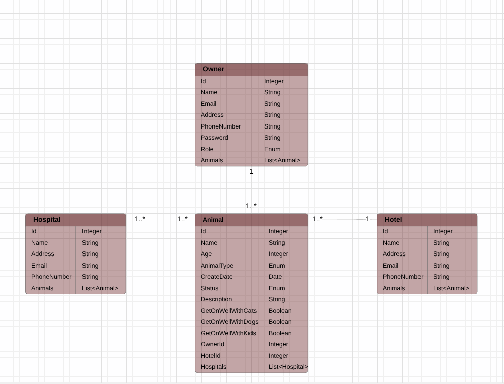

# Shelter - Állatotthon

## 1. Rövid leírás

A shelter egy menhely, kutyák és macskák számára, valamint átmeneti állatpanzió, ahol vigyázunk a kisállatra, amíg a gazdi nyaralni megy, vagy valami miatt el kell utaznia és nem tudja magával vinni kedvencét. Az adatbázisba minden állat és amennyiben van neki a gazdája is bekerül. 

 A menhelyes kutyáknak minden állatkórházi kezeléséről listát vezetünk, hogy ha valaki szeretné örökbe fogadni, tisztában legyen a régebbi betegségeivel. Egy felhasználó (role_ugyfel) regisztrálás után, többféle szűrési feltétellel kilistázhatja a menhelyes állatokat, hogy a saját feltételeinek legmegfelelőbb állatot találja meg magának. A dolgozók (role_admin) hozzáadhatnak állatokat, ha új lakó érkezett a menhelyre, törölhetnek vagy módosíthatnak az állatokon, ha valamelyik információ megváltozott. Ha egy állatot örökbe fogadnak, benne marad az adatbázisban és hozzá rendeljük az új gazda adatait, hogy később is legyem információnk az állatról. 

 A panzióban az állatok megőrzése fix napi összeg ellenében lehetséges. Ha beírjuk hogy hány napig marad, autómatikusan kiszámolódik a fizetendő összeg, ami kutya és macska esetében eltérő.

## 3. Adatbázisterv

  

## 4. Végpontok

 - **GET/** 
 	> főoldal
 - **GET/animal** 
 	> összes animal-t megjelenítő oldal
 - **GET/animal/{animalId}** 
 	> egy animal megjelenítése
 - **GET/owner** 
 	> felhasználók kilistázása
 - **GET/owner/{ownerId}** 
 	> egy felhasználó megjelenítése
 - **GET/hospital**
 	> kórházak megjelenítése
 - **GET/hospital/{hospitalId}**
 	> egy kórház megjelenítése
 - **GET/hotel**
 	> hotelek megjelenítése
 - **GET/animal/cats**
 	> cicák megjelenítése
 - **GET/animal/dogs**
 	> kutyák megjelenítése
 - **POST/owner/registration**
 	> felhasználó regisztrálása
 - **POST/animal/post**
 	> animal regisztrálása
 - **PUT/animal/put/{id}**
 	> egy animal adatainak módosítása
 - **PUT/owner/put/{id}**
 	> egy felhasználó adatainak módosítása
 - **DELETE/owner/delete/{id}**
 	> adott felhasználó törlése
 - **DELETE/animal/delete/{id}**
 	> adott animal törlése

## 5. Kliens oldali komponensek

- **home** 
 	> főoldal
- **header**
	> fejléc - főmenü
- **login**
	> bejelentkezés
- **animal-home**
	> segéd komponens, a gyerek routerek működéséhez
- **animal**
	> állatok listája
- **animal-by-id**
	> egy állat adatai
- **animal-post**
	> állat hozzáadása
- **animal-put**
	> állat adatainak módosítása
- **cats**
	> macskák listája
- **dogs**
	> kutyák listája
- **owner-home**
	> segéd komponens, a gyerek routerek működéséhez
- **owner**
	> felhasználók listája
- **owner-by-id**
	> egy felhasználó adatai
- **owner-post**
	> felhasználó hozzáadása
- **owner-put**
	> felhasználó adatainak módosítása
- **hospital**
	> a kórházi osztályok listája
- **hotel**
	> a hotel adatai
- **services**
	- auth
	- animal
	- owner
	- hospital
	- hotel
	> kapcsolódás backendhez

